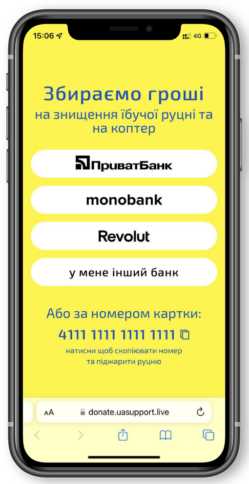

# Шаблон сторінки для донатів

Демо - https://donate.uasupport.live

## Призначення
Зручная локанічна сторінка із основними варіантами доната.\
Лінку на таку сторінку зручно постити в соціальніх мережах та шерити у чатах.

## Особливості:
- Мобайл френдлі
- Респонсів
- Жодної залежності
- Палить руцню

## Використання
Ви можете розмістити сторінку на будь якому сервері або скористись сервісом githab pages.\
Якщо Ви волонтер, та сбираєте гроші на потреби Збройних Сил України, Територіальної Оборони або для допомоги цивільному населенню, то можете користуватись шаблоном абсолютно вільно без будь якого посилання на авторів.\
Крім того, якщо Ви, знов-таки, волонтер, ми можемо надати технічну допомогу з **безкоштовним** розгортанням сторінки та розміщенню її на будь-якому піддомені типу
`https://_yourname_.uasupport.live`\
Запит на допомогу із цим [залишайте тут](https://github.com/SergiiVdovareize/donate/issues/3).

## Автори
Ідея та розробка - [Сергій Вдоварейзе](https://github.com/SergiiVdovareize)\
Дизайн - [Аліна Хабачова](https://alinakhabachova.com)\
Верстка - [Антон Клижка](https://github.com/klyzhka)\
 \
 \
*Інструкція [наросійській](README.orc.md)*

---
## 💛 Support Ukraine 💙

